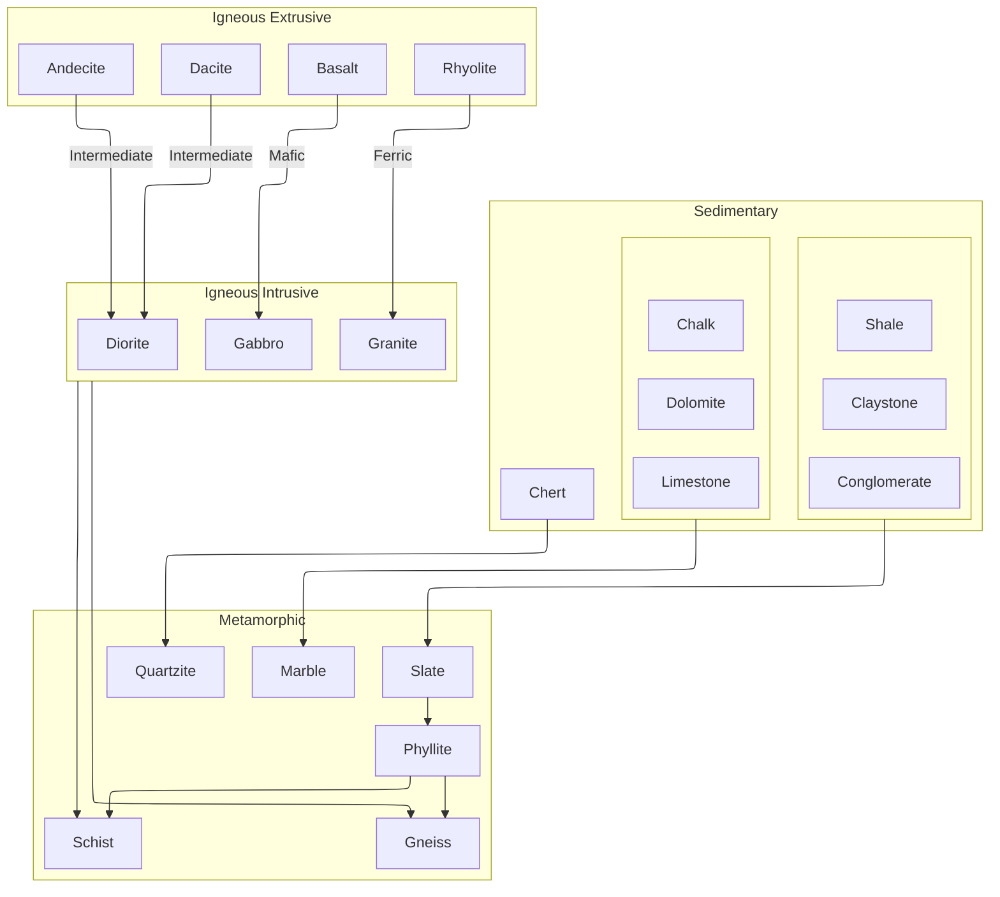

# Terrafirmacraft Basics

## Geology
In TerrafirmaGreg, a region has normally 3, sometimes 4 layers of rocks. The rock type of a region determines which ore vains to be generated, so it is important to know the forming of rocks.

The forming of rocks follows this diagram:

Each arrow indicates what rocks usually form underneath it. For example, quartzite is likely to form under chert. The text on arrows between igneous extrusive and intrusive indicates the grade of those rocks.

Sedimentary and igneous extrusive rocks can form in the top layer, and following rocks will form according to the rules above. Ocean floors are made up of igneous extrusive rocks.

Sometimes there are Dikes, which are small lines of igneous intrusive rocks. Dikes works as a sample rock of the deeper layer.

## Climate
Climate is an important factor of which plants and animals would live. It is calculated from two factors: temperature and hydration.
Regional temperature is again set by three factors: latitude(Z coordinate), season, and daily time, in which latitude is the strongest. Usually going north(Z -) lowers regional temperature, and south(Z +) increases. It seems that around Z: 5000 is set to be the equator of a world.
Hydration is mainly calculated by longitude(X coordinate). Going east(X +) increases it while going west(X -) decreases.

## Nutrition
There are 5 categories of nutrition: Grain, Protein, Fruit, Vegetable, and Dairy. Each food has its own value of nutrients. Since it is hard to maintain being highly nourished, some options for merging foods are available.

---
Go To:
[[20250219122135]] Guide for TerrafirmaGreg
