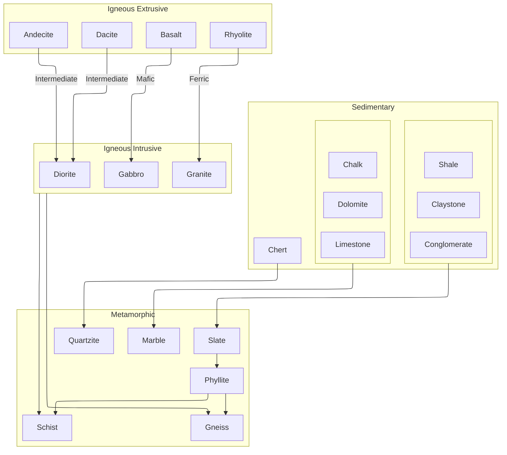

# Geology
In TerrafirmaGreg, a region has normally 3, sometimes 4 layers of rocks. The rock type of a region determines which ore vains to be generated, so it is important to know the forming of rocks.

The forming of rocks follows this diagram:

Each arrow indicates what rocks usually form underneath it. For example, quartzite is likely to form under chert. The text on arrows between igneous extrusive and intrusive indicates the grade of those rocks.

Sedimentary and igneous extrusive rocks can form in the top layer, and following rocks will form according to the rules above. Ocean floors are made up of igneous extrusive rocks.

Sometimes there are Dikes, which are small lines of igneous intrusive rocks. Dikes works as a sample rock of the deeper layer.